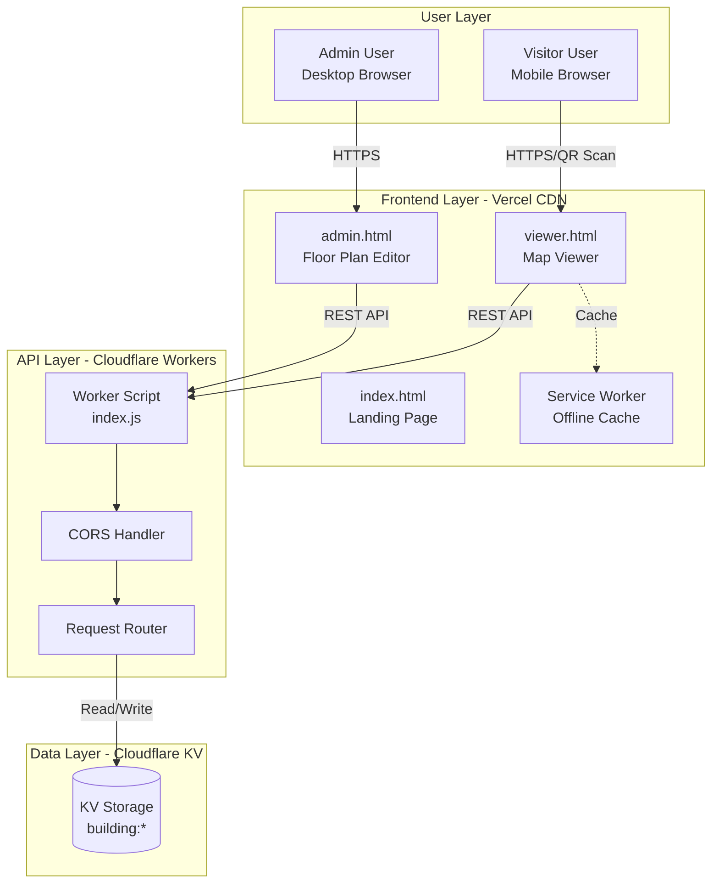
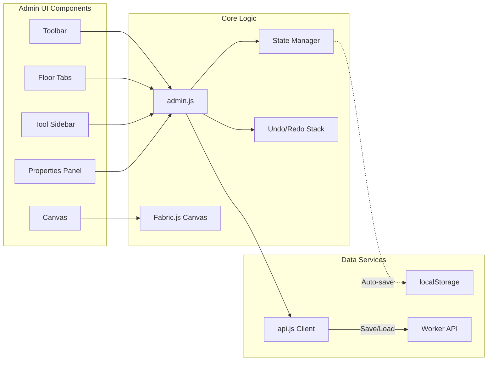
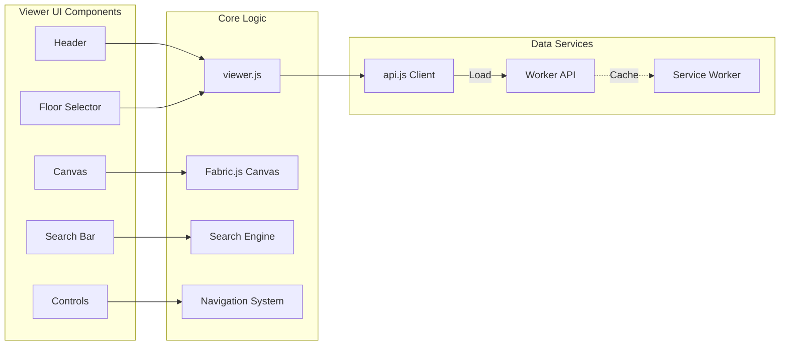
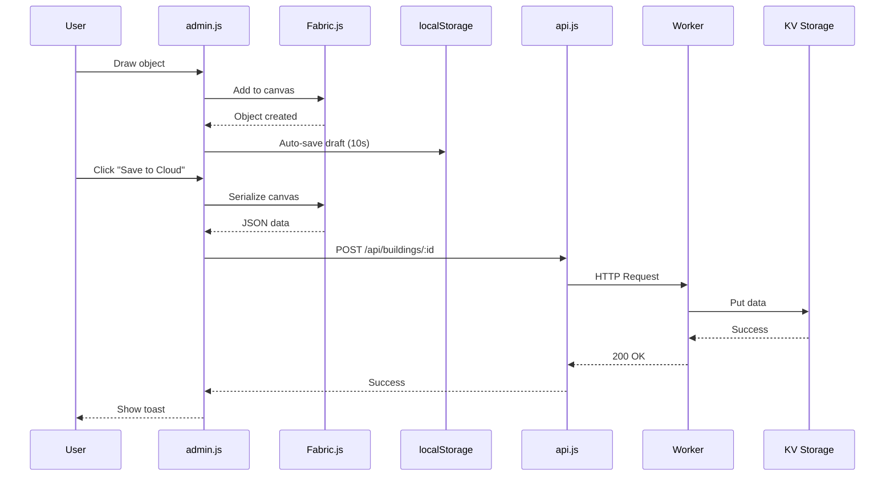

# IntraMap - Technical Architecture Document

**Version:** 2.0  
**Last Updated:** February 16, 2026  
**Document Type:** Technical Specification

---

## Table of Contents

1. [System Overview](#system-overview)
2. [Architecture Diagrams](#architecture-diagrams)
3. [Component Specifications](#component-specifications)
4. [File Structure](#file-structure)
5. [Code Organization](#code-organization)
6. [Data Models](#data-models)
7. [State Management](#state-management)
8. [Testing Strategy](#testing-strategy)
9. [Deployment Architecture](#deployment-architecture)
10. [Performance Optimization](#performance-optimization)

---

## 1. System Overview

### 1.1 Architecture Pattern
**JAMstack Architecture** (JavaScript, APIs, Markup)
- **Static Frontend:** Pre-built HTML/CSS/JS served from CDN
- **Serverless Backend:** Edge functions for dynamic data
- **Client-Side Rendering:** Canvas manipulation in browser

### 1.2 Technology Decisions

| Decision | Technology | Rationale |
|----------|-----------|-----------|
| **Frontend Framework** | Vanilla JS | No build step, faster load, simpler deployment |
| **Canvas Library** | Fabric.js | Mature, feature-rich, good documentation |
| **Backend Runtime** | Cloudflare Workers | Free tier, edge computing, global distribution |
| **Database** | Cloudflare KV | Free tier, low latency, simple key-value model |
| **Hosting** | Vercel | Free tier, automatic deployments, CDN |
| **QR Generation** | QRCode.js | Lightweight, client-side, no dependencies |

---

## 2. Architecture Diagrams

### 2.1 High-Level System Architecture



### 2.2 Admin Editor Component Architecture



### 2.3 Viewer Component Architecture



### 2.4 Data Flow Diagram



---

## 3. Component Specifications

### 3.1 Frontend Components

#### admin.html - Floor Plan Editor

**Purpose:** Visual editor for creating floor plans

**Key Features:**
- Dynamic floor management
- Drawing tools (shapes, lines, icons)
- Properties panel
- Keyboard shortcuts
- Auto-save to localStorage
- Cloud sync

**Dependencies:**
- Fabric.js v5.3.0
- QRCode.js v1.0.0
- api.js
- admin.css

**State:**
```javascript
{
  buildingData: {
    version: "1.0",
    buildingId: string,
    name: string,
    createdAt: ISO8601,
    updatedAt: ISO8601,
    floors: {
      [floorId]: {
        name: string,
        objects: Array<FabricObject>
      }
    }
  },
  currentFloor: string,
  currentTool: 'select' | 'rect' | 'circle' | 'text' | 'line',
  currentColor: string,
  selectedObject: FabricObject | null,
  undoStack: Array<CanvasState>,
  redoStack: Array<CanvasState>,
  isDrawingLine: boolean,
  lineStartPoint: {x: number, y: number} | null
}
```

#### viewer.html - Map Viewer

**Purpose:** Public-facing navigation interface

**Key Features:**
- Interactive floor plan display
- Search functionality
- "You Are Here" marker
- Visual navigation
- Offline support (PWA)

**Dependencies:**
- Fabric.js v5.3.0
- api.js
- viewer.css
- Service Worker

**State:**
```javascript
{
  buildingData: BuildingDocument,
  currentFloor: string,
  allObjects: Array<FabricObject>,
  searchResults: Array<SearchResult>,
  youAreHereMarker: FabricObject | null,
  selectedObject: FabricObject | null,
  navigationPath: FabricObject | null
}
```

### 3.2 Backend Components

#### worker/index.js - API Server

**Purpose:** Serverless API for building data

**Endpoints:**
- `GET /api/buildings/:id` - Retrieve building
- `POST /api/buildings/:id` - Save building
- `GET /api/buildings` - List all buildings (optional)

**Functions:**
```javascript
saveBuilding(request, env, buildingId)
getBuilding(env, buildingId)
listBuildings(env)
isValidBuildingId(buildingId)
jsonResponse(data, status)
handleCORS()
```

**Environment Variables:**
```javascript
env.BUILDINGS // KV namespace binding
```

---

## 4. File Structure

```
IntraMap/
├── public/                          # Frontend static files
│   ├── index.html                   # Landing page (entry point)
│   ├── admin.html                   # Floor plan editor
│   ├── viewer.html                  # Map viewer
│   │
│   ├── css/
│   │   ├── common.css               # Shared styles (reset, utilities)
│   │   ├── admin.css                # Editor-specific styles
│   │   └── viewer.css               # Viewer-specific styles
│   │
│   ├── js/
│   │   ├── admin.js                 # Editor logic (936 lines)
│   │   │   ├── Initialization
│   │   │   ├── Floor management
│   │   │   ├── Drawing tools
│   │   │   ├── Properties panel
│   │   │   ├── Keyboard shortcuts
│   │   │   ├── Undo/redo
│   │   │   └── Save/load
│   │   │
│   │   ├── viewer.js                # Viewer logic (554 lines)
│   │   │   ├── Initialization
│   │   │   ├── Floor loading
│   │   │   ├── Search
│   │   │   ├── Navigation
│   │   │   └── Offline support
│   │   │
│   │   ├── api.js                   # API client (114 lines)
│   │   │   ├── IntraMapAPI class
│   │   │   ├── saveBuilding()
│   │   │   ├── loadBuilding()
│   │   │   └── sanitizeBuildingId()
│   │   │
│   │   └── icons.js                 # Icon library (optional)
│   │
│   ├── lib/                         # External libraries
│   │   ├── fabric.min.js            # Canvas manipulation (v5.3.0)
│   │   └── qrcode.min.js            # QR generation (v1.0.0)
│   │
│   ├── manifest.json                # PWA manifest
│   └── sw.js                        # Service worker
│
├── worker/                          # Cloudflare Worker
│   ├── index.js                     # Worker script (193 lines)
│   └── wrangler.toml                # Worker configuration
│
├── sample-data/                     # Sample building data
│   └── demo-building.json           # Demo mall data
│
├── upload-sample.js                 # Script to upload sample data
├── package.json                     # NPM dependencies
├── vercel.json                      # Vercel configuration
├── README.md                        # User documentation
├── DEPLOYMENT.md                    # Deployment guide
└── QUICKSTART.md                    # Quick start guide
```

---

## 5. Code Organization

### 5.1 admin.js Structure

```javascript
// ========== GLOBAL STATE ==========
let canvas;
let buildingData = { ... };
let currentFloor = 'floor_1';
let currentTool = 'select';
let selectedObject = null;
let undoStack = [];
let redoStack = [];
// ... other state variables

// ========== INITIALIZATION ==========
window.addEventListener('DOMContentLoaded', () => {
    initializeCanvas();
    initializeToolbar();
    initializeKeyboardShortcuts();
    loadDraft();
    startAutoSave();
});

// ========== CANVAS MANAGEMENT ==========
function initializeCanvas() { ... }
function clearCanvas() { ... }

// ========== FLOOR MANAGEMENT ==========
function renderFloorTabs() { ... }
function switchFloor(floorId) { ... }
function addNewFloor() { ... }
function renameFloor(floorId) { ... }
function removeFloor(floorId) { ... }
function showFloorContextMenu(floorId, x, y) { ... }

// ========== DRAWING TOOLS ==========
function selectTool(tool) { ... }
function addShapeAtPosition(x, y) { ... }
function handleLineDrawing(e) { ... }

// ========== PROPERTIES PANEL ==========
function showPropertiesPanel(obj) { ... }
function clearPropertiesPanel() { ... }

// ========== KEYBOARD SHORTCUTS ==========
function initializeKeyboardShortcuts() { ... }
function saveState() { ... }
function undo() { ... }
function redo() { ... }

// ========== DATA PERSISTENCE ==========
function saveCurrentFloorToData() { ... }
function loadFloorToCanvas(floorId) { ... }
function saveDraft() { ... }
function loadDraft() { ... }
function saveToCloud() { ... }
function loadFromCloud() { ... }

// ========== UI HELPERS ==========
function showToast(message, type) { ... }
function showQRModal() { ... }
function bringToFront() { ... }
function sendToBack() { ... }
function deleteSelected() { ... }
```

### 5.2 viewer.js Structure

```javascript
// ========== GLOBAL STATE ==========
let canvas;
let buildingData = null;
let currentFloor = 'floor_1';
let allObjects = [];
let youAreHereMarker = null;

// ========== INITIALIZATION ==========
window.addEventListener('DOMContentLoaded', () => {
    initializeCanvas();
    initializeControls();
    loadBuildingData();
});

// ========== DATA LOADING ==========
async function loadBuildingData() { ... }
function populateFloorSelector() { ... }
function loadFloorToCanvas(floor) { ... }

// ========== SEARCH ==========
function handleSearch(e) { ... }
function performSearch(query) { ... }
function highlightObject(obj) { ... }

// ========== NAVIGATION ==========
function placeYouAreHere() { ... }
function showObjectDetails(obj) { ... }
function showDirections(targetObj) { ... }

// ========== OFFLINE SUPPORT ==========
function cacheBuilding(data) { ... }
function loadFromCache() { ... }

// ========== UI HELPERS ==========
function showToast(message, type) { ... }
function showError(message) { ... }
```

### 5.3 api.js Structure

```javascript
class IntraMapAPI {
    constructor(baseURL) {
        this.baseURL = baseURL || window.INTRAMAP_API_URL || 'default-url';
    }

    async saveBuilding(buildingId, buildingData) { ... }
    async loadBuilding(buildingId) { ... }
    sanitizeBuildingId(name) { ... }
}
```

---

## 6. Data Models

### 6.1 Building Document

```typescript
interface BuildingDocument {
  version: "1.0";
  buildingId: string;
  name: string;
  createdAt: string; // ISO8601
  updatedAt: string; // ISO8601
  floors: {
    [floorId: string]: Floor;
  };
}

interface Floor {
  name: string;
  objects: FabricObject[];
}

interface FabricObject {
  type: 'rect' | 'circle' | 'i-text' | 'line' | 'group';
  left: number;
  top: number;
  width: number;
  height: number;
  scaleX: number;
  scaleY: number;
  angle: number;
  fill: string;
  stroke: string;
  strokeWidth: number;
  strokeDashArray?: number[] | null;
  opacity: number;
  objectLabel: string;
  objectTags: string;
  objectIcon?: string | null;
  objectLocked: boolean;
  
  // Text-specific
  text?: string;
  fontSize?: number;
  fontFamily?: string;
}
```

### 6.2 Search Result

```typescript
interface SearchResult {
  object: FabricObject;
  floor: string;
  score: number;
  matchType: 'label' | 'tag';
}
```

### 6.3 Canvas State (for Undo/Redo)

```typescript
interface CanvasState {
  floor: string;
  json: string; // Serialized canvas JSON
  timestamp: number;
}
```

---

## 7. State Management

### 7.1 Admin State Flow

```
User Action
    ↓
Update Canvas (Fabric.js)
    ↓
Update buildingData object
    ↓
Save to undoStack
    ↓
Auto-save to localStorage (10s interval)
    ↓
Manual "Save to Cloud"
    ↓
POST to Worker API
    ↓
Store in KV
```

### 7.2 Viewer State Flow

```
Page Load
    ↓
Extract building ID from URL
    ↓
GET from Worker API
    ↓
Store in buildingData
    ↓
Render canvas
    ↓
Cache in Service Worker
    ↓
User Interaction (search, navigate)
    ↓
Update UI (no server calls)
```

### 7.3 Undo/Redo Implementation

```javascript
// Undo Stack (LIFO - Last In First Out)
undoStack = [
  { floor: 'floor_1', json: '...', timestamp: 123456 },
  { floor: 'floor_1', json: '...', timestamp: 123457 },
  { floor: 'floor_2', json: '...', timestamp: 123458 }
]

// Redo Stack (cleared on new action)
redoStack = [
  { floor: 'floor_2', json: '...', timestamp: 123459 }
]

// Max 50 states to prevent memory issues
if (undoStack.length > 50) {
  undoStack.shift(); // Remove oldest
}
```

---

## 8. Testing Strategy

### 8.1 Manual Testing Checklist

**Admin Editor:**
- [ ] Floor management (add, rename, delete)
- [ ] Drawing tools (rect, circle, text, line)
- [ ] Styling controls (width, style, opacity)
- [ ] Keyboard shortcuts (Ctrl+Z, Delete, Escape)
- [ ] Properties panel updates
- [ ] Auto-save to localStorage
- [ ] Save to cloud
- [ ] Load from cloud
- [ ] QR code generation

**Viewer:**
- [ ] Load building from URL parameter
- [ ] Floor selector population
- [ ] Search functionality
- [ ] "You Are Here" placement
- [ ] Navigation directions
- [ ] Offline mode (disconnect internet)
- [ ] Mobile responsiveness

**API:**
- [ ] POST building data
- [ ] GET building data
- [ ] 404 for non-existent buildings
- [ ] CORS headers present
- [ ] Building ID validation

### 8.2 Browser Compatibility Testing

**Desktop:**
- [ ] Chrome 90+
- [ ] Firefox 88+
- [ ] Safari 14+
- [ ] Edge 90+

**Mobile:**
- [ ] iOS Safari
- [ ] Chrome Android
- [ ] Samsung Internet

### 8.3 Performance Testing

**Metrics to Monitor:**
- Page load time < 2s
- Time to interactive < 3s
- Canvas render time < 500ms
- Search response time < 100ms

**Load Testing:**
- 100+ objects on single floor
- 10+ floors in single building
- Large building data (> 500KB JSON)

---

## 9. Deployment Architecture

### 9.1 Production Environment

```
┌─────────────────────────────────────────────────────────┐
│  Cloudflare Global Network (200+ cities)                │
│  ┌───────────────────────────────────────────────────┐  │
│  │  Workers (Edge Computing)                         │  │
│  │  - Runs in V8 isolates                            │  │
│  │  - < 10ms CPU time per request                    │  │
│  │  - Auto-scales globally                           │  │
│  └─────────────────┬─────────────────────────────────┘  │
│                    │                                     │
│  ┌─────────────────▼─────────────────────────────────┐  │
│  │  KV Storage (Eventually Consistent)               │  │
│  │  - Replicated globally                            │  │
│  │  - < 100ms read latency                           │  │
│  │  - 60s write propagation                          │  │
│  └───────────────────────────────────────────────────┘  │
└─────────────────────────────────────────────────────────┘

┌─────────────────────────────────────────────────────────┐
│  Vercel Edge Network (Global CDN)                       │
│  ┌───────────────────────────────────────────────────┐  │
│  │  Static Assets (HTML, CSS, JS)                    │  │
│  │  - Cached at edge locations                       │  │
│  │  - Automatic HTTPS                                │  │
│  │  - Brotli compression                             │  │
│  └───────────────────────────────────────────────────┘  │
└─────────────────────────────────────────────────────────┘
```

### 9.2 Deployment Process

**Frontend (Vercel):**
```bash
# Automatic deployment via GitHub
git push origin main
→ Vercel detects push
→ Builds project
→ Deploys to production
→ Invalidates CDN cache
→ Live in ~30 seconds
```

**Backend (Cloudflare):**
```bash
# Manual deployment via Wrangler
cd worker
wrangler deploy
→ Uploads worker script
→ Deploys to all edge locations
→ Live in ~10 seconds
```

### 9.3 Environment Configuration

**Production URLs:**
- Frontend: `https://intra-map-six.vercel.app`
- Backend: `https://intramap-api.kaleempk555.workers.dev`

**Environment Variables:**
```javascript
// Set in HTML or api.js
window.INTRAMAP_API_URL = 'https://intramap-api.kaleempk555.workers.dev';
```

---

## 10. Performance Optimization

### 10.1 Frontend Optimizations

**Code Splitting:**
- Separate CSS files per page
- Load Fabric.js only when needed
- Lazy load QRCode.js

**Asset Optimization:**
- Minified libraries
- Brotli compression
- CDN caching

**Canvas Optimization:**
```javascript
// Disable unnecessary rendering
canvas.renderOnAddRemove = false;

// Batch updates
canvas.add(obj1, obj2, obj3);
canvas.renderAll();

// Use object caching
obj.set({ objectCaching: true });
```

### 10.2 Backend Optimizations

**KV Caching:**
```javascript
// Cache-Control headers
'Cache-Control': 'public, max-age=300' // 5 minutes
```

**Response Compression:**
- Automatic gzip/brotli by Cloudflare
- JSON minification

**Edge Computing:**
- Data served from nearest location
- < 100ms latency globally

### 10.3 PWA Optimizations

**Service Worker Caching:**
```javascript
// Cache static assets
cache.addAll([
  '/index.html',
  '/admin.html',
  '/viewer.html',
  '/css/common.css',
  '/js/admin.js',
  '/lib/fabric.min.js'
]);

// Cache building data
cache.put(buildingUrl, response.clone());
```

**Offline Strategy:**
- Cache-first for static assets
- Network-first for building data
- Fallback to cache if offline

---

## Appendix

### A. Code Metrics

| File | Lines | Size | Complexity |
|------|-------|------|------------|
| admin.js | 936 | 28KB | High |
| viewer.js | 554 | 16KB | Medium |
| api.js | 114 | 3KB | Low |
| worker/index.js | 193 | 6KB | Low |

### B. Dependencies

**Production:**
- Fabric.js v5.3.0 (MIT License)
- QRCode.js v1.0.0 (MIT License)

**Development:**
- Wrangler CLI (Cloudflare)
- Vercel CLI

### C. Browser APIs Used

- Canvas API
- Fetch API
- localStorage API
- Service Worker API
- History API
- URL API

---

**Document Control:**
- **Created:** February 16, 2026
- **Last Updated:** February 16, 2026
- **Owner:** M Kaleem Akhtar
- **Status:** Living Document
